## Procedure

                            
                            

Please follow these steps to do the experiment.

                             
                             
                            
 
Part 1:

                         
<ol>
                            
 <li class="expt1">	At first go through the structure of 74153.Then apply high level voltage to Vcc and low level voltage to GND. If Vcc and ground are not connected properly then error message will be shown and no output will be generated.
</li>

</ul>

 

 

<ul style="list-style:none">
                            	<li class="expt1">	2. &nbsp;Next,  apply high level voltage to Strobe1G  or strobe 2G. If STROBE 1G is high 2nd Multiplexer  is activated . If STROBE 2G is high then 1st Multiplexer is activated.
.</li>
                                </ul>
                                
  
                                
 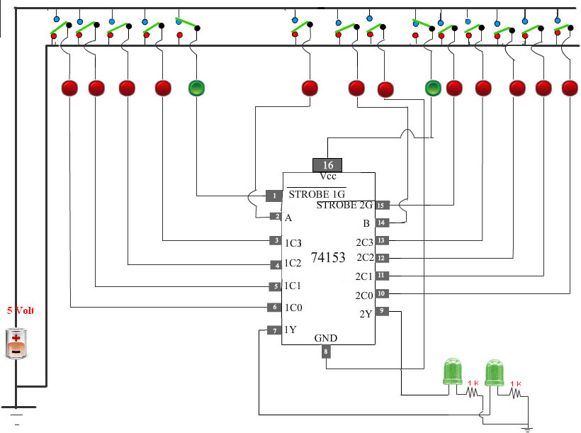
 
                                
 <ul style="list-style:none">
                                <li class="expt1">	3. &nbsp;Next, apply low level voltage to the select inputs A and B (A Most significant Bit,B Less significant bit). Then apply a high level voltage to 2C0. Now check that how Dual 4 Line to 1 Line Multiplexer select the particular input to be multiplexed and to be
applied to the output IY{1 = 1, 2}. </li>
</ul>

 
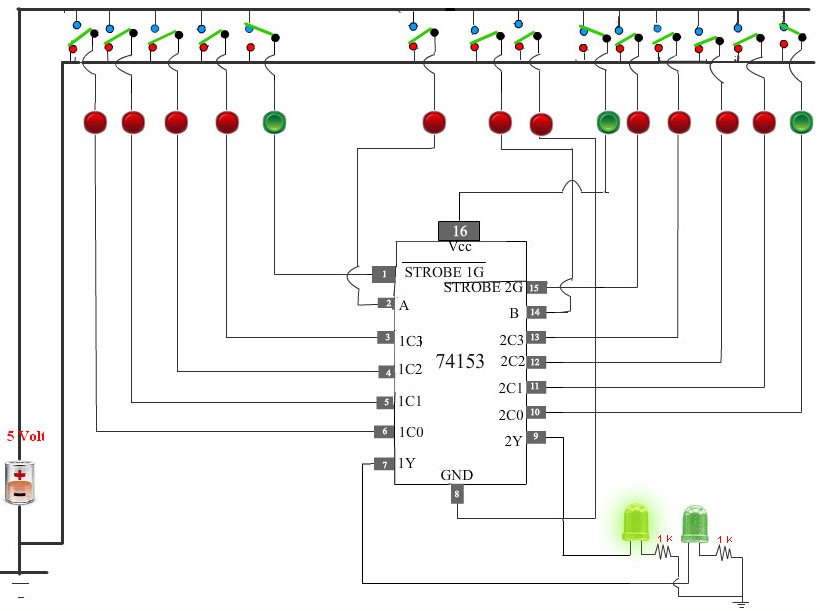
 

<ul style="list-style:none">
<li class="expt1">	4. &nbsp;For all the combinations of the select inputs A,B verify that both the LEDs are glowing 
                                or not glowing. If the LED glows, it indicates that the corresponding output has reached logic 1 level. Similarly
                                a dark LED indicates low level output voltage.</li>
                                </ul>
                                 
                                
                               

<ul style="list-style:none">

<li class="expt1">	5. &nbsp;If both the Strobe inputs are low then both Multiplexers are activated. </li>

</ul>
 

 
 
       
 
Part 2:
                         
                                
                              
 <ul style="list-style:none">
                            
 <li class="expt1">	1. &nbsp;At first go through the structure of 74157.Then apply high level voltage to Vcc and low level voltage to GND. If Vcc and ground are not connected properly then error message will be shown and no output will be generated.
</li>

</ul>
 

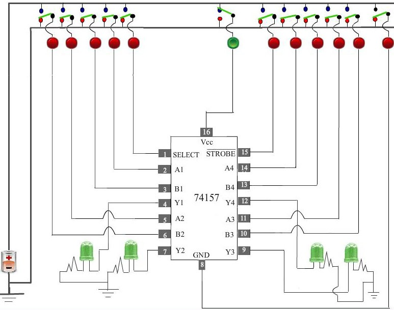
 

<ul style="list-style:none">
                                
 <li class="expt1">	2. &nbsp;Next,  apply high level voltage to Strobe input.Now check that all the LEDs are not  glowing.Soall the outputs are at low state
.</li>
</ul>
 
 
  
 
 
  <ul style="list-style:none">
                                <li class="expt1">	3. &nbsp;Next,  apply low level voltage to the Strobe input  and also apply low level voltage to the Select input.  Then apply high level voltage to A1,A2,A3,A4.Now check that all the LEDs are glowing.Because inputs are properly multiplexed to the outputs of the four multiplexers according to the voltage applied to the select input. </li>
                                </ul>
                                 
                                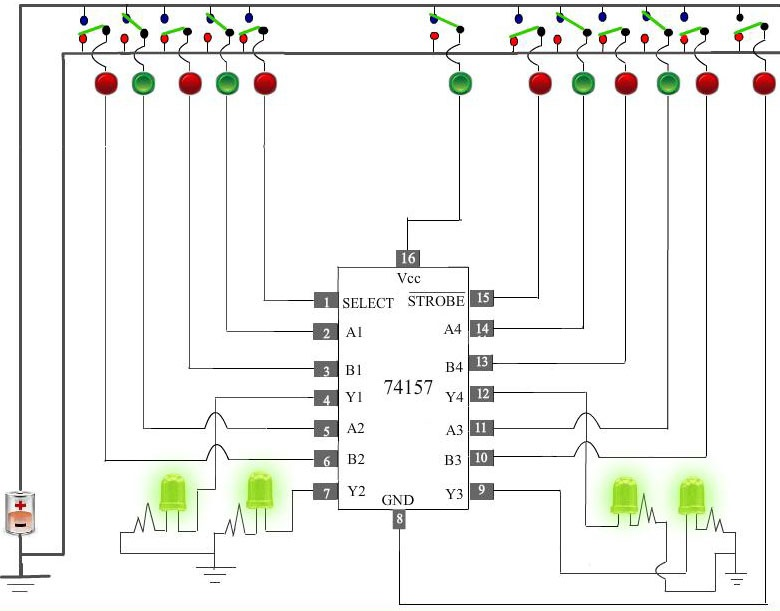
                                 

<ul style="list-style:none">
<li class="expt1">	4. &nbsp;Next,  apply low level voltage to the Strobe input  and apply high level voltage to the Select input. Then apply high level voltage to B1,B2,B3,B4. Now check that all the LEDs are glowing.Because inputs are properly multiplexed to the outputs of the four multiplexers according to the voltage applied to the select input. </li>
</ul>
  
 
  
 
 
<ul style="list-style:none">
<li class="expt1">	5. &nbsp;If the LED glows, it indicates that the corresponding output has reached logic 1 level. Similarly
                                a dark LED indicates low level output voltage.  </li>
                                </ul>
                                
  
                                
                                
 
Part 3:

                                
<ul style="list-style:none">
                                <li class="expt1">1.&nbsp;At first click on the Browse Block button</li>
                                <li class="expt1">2.&nbsp;Next, drag the mux block and drop it onto the bread board.</li>
                                
                                
</ul>
                                 
                               

                                 
                                 
                               
 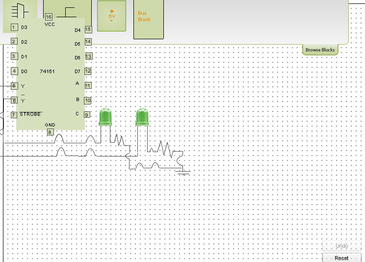
                                 
                                 
                               
                                
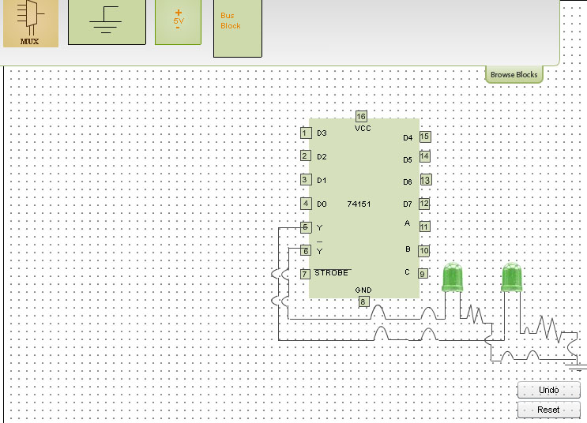
                                 
                                
<ul style="list-style:none">
                               
 <li class="expt1">3.&nbsp;Next, drag the Bus block and drop it onto the bread board.</li>
                                
                                
 </ul>
                                 
                                
                                

                                 
                                 
                               
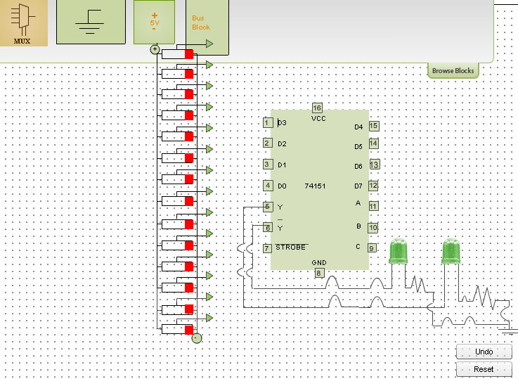
                                 
                                
                                
  <ul style="list-style:none">
                               
 <li class="expt1">4.&nbsp;Next, drag the Voltage block and drop it onto the bread board.</li>
                                
                                
 </ul>
                                
 
                               
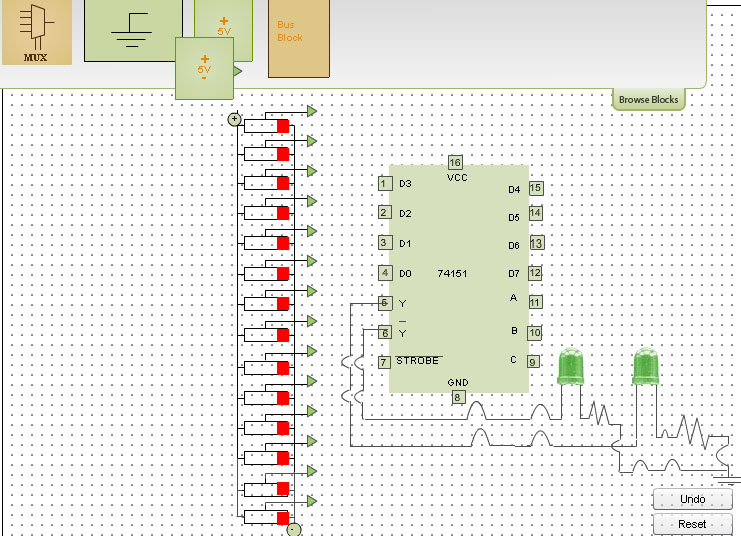
                                 
                                 
                               
 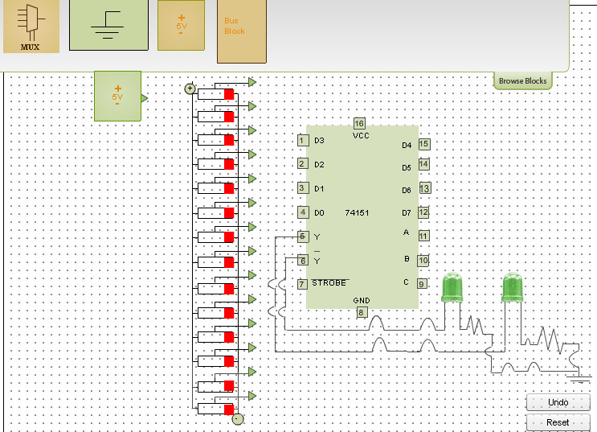
                                 
                                
                                
<ul style="list-style:none">
                               
  <li class="expt1">5.&nbsp;Next, drag the Ground block and drop it onto the bread board.</li>
                                
                                
</ul>
                                
   
                               

                                 
                                 
                                
 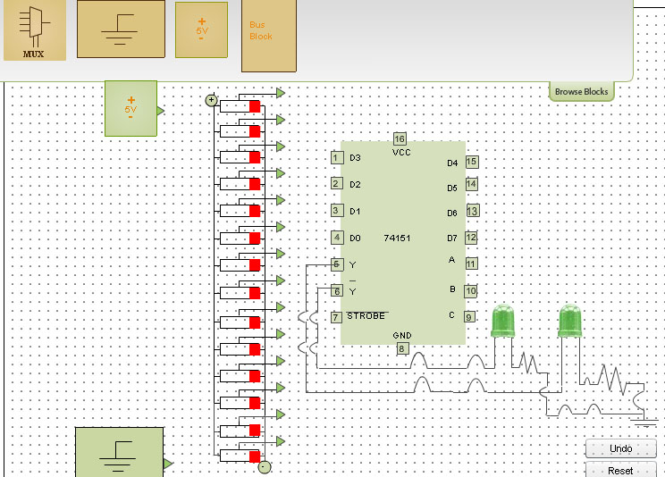
                                  
                                
                                
 <ul style="list-style:none">
                                
                                
                               
 <li class="expt1">5.&nbsp;Next, make a connection from voltage block to positive end of the bus block.</li>
                                
                                
</ul>
                                
                                
 
                               
  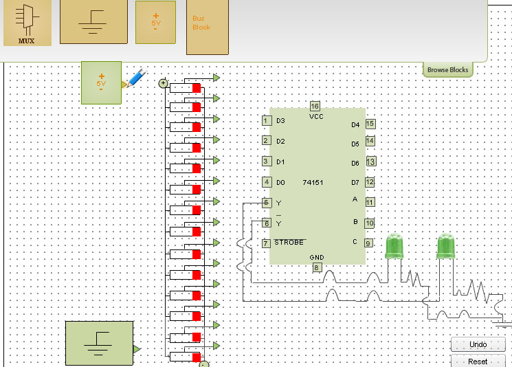
                               
                                
  
                                 
                                
                                  
                                 
                                
                                

                                
                                
  
                                
                                
 <ul style="list-style:none">
                               
<li class="expt1">6.&nbsp;Next, make a connection from ground block to negitive end of the bus block.</li>
                                
                                
 </ul>
                                
                                 
 
                                 
                                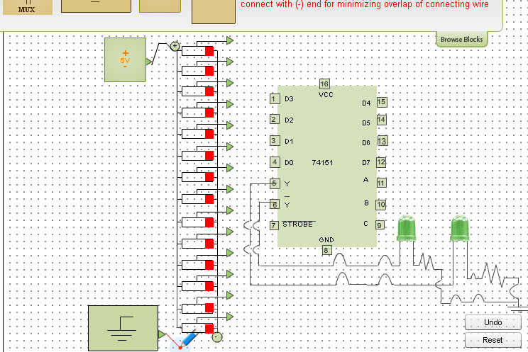
                                  
                                 
                                
                               
 
                                
                                
  
                                   
                                 

The 14 switches constituting the Bus Block are denoted as A,B,C...N as one goes bottomwards starting with the top switch A .

                                
  <ul style="list-style:none">
                               
 <li class="expt1">7.&nbsp;Next, make a connection from switch A to D7 of the MUX block.</li>
                                
                                
 </ul>
                                 
                                
 
                                 
                                 
                               
 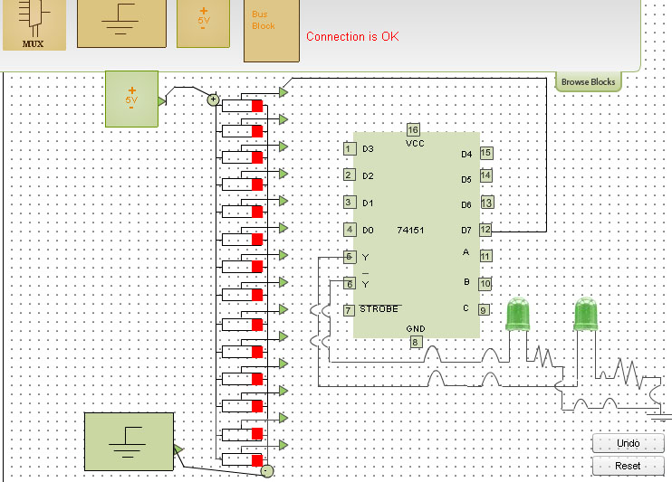
                                
 
                                 
 <ul style="list-style:none">
                               
 <li class="expt1">8.&nbsp;Next, make a connection from switch B to D6 of the MUX block.</li>
                                
                                
 </ul>
                                
  
                                
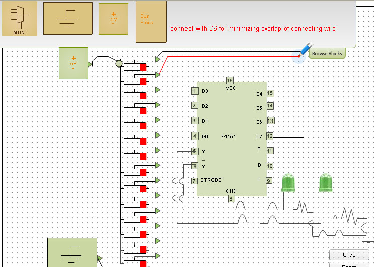
                                 
                                 
                               
 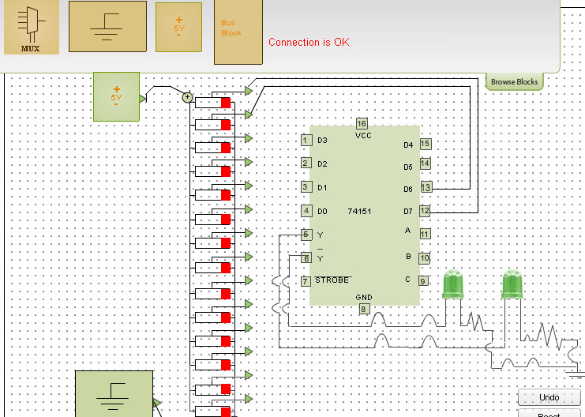
                                
   
                                 
                                 
 <ul style="list-style:none">
                               
  <li class="expt1">8.&nbsp;Next, make a connection from switch C to D5 of the MUX block.</li>
                                
                                
</ul>
                                
  
                                

                                 
                                 
                               
  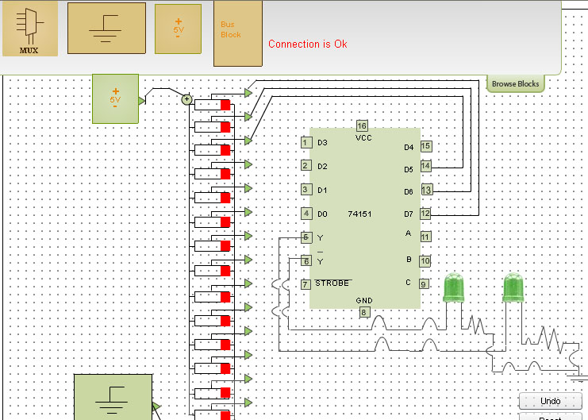
                                
    
                                 
                                 
  <ul style="list-style:none">
                               
 <li class="expt1">9.&nbsp;Next, make a connection from switch D to D4 of the MUX block.</li>
                                
                                
 </ul>
                                
   
                                
 
                                 
                                 
                               
 
                                 
                                
   
                                 
                                 
 <ul style="list-style:none">
                               
 <li class="expt1">10.&nbsp;Next, make a connection from switch E to VCC of the MUX block.</li>
                                
                                
 </ul>
                                
   
                                
 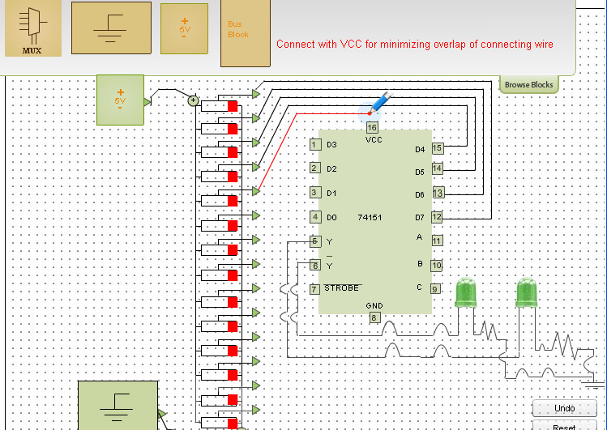
                                 
                                 
                               
 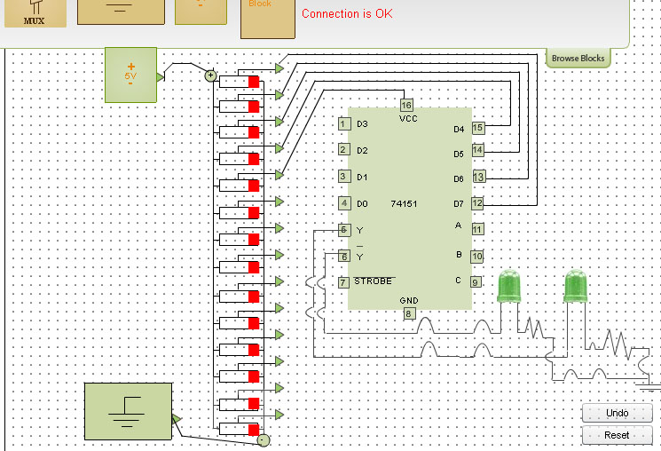
                                 
                                 
                                 
                                 
 <ul style="list-style:none">
                               
 <li class="expt1">11.&nbsp;Next, make a connection from switch F to D3 of the MUX block.</li>
                                
                                
</ul>
                                
  
                                
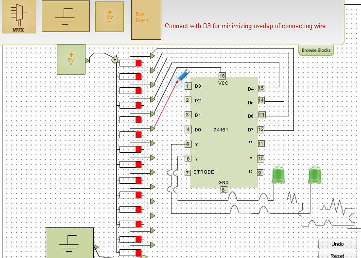
                                 
                                 
                               
   
                                 
                                
                                
 <ul style="list-style:none">
                               
 <li class="expt1">12.&nbsp;Next, make a connection from switch G to D2 of the MUX block.</li>
                                
                                
 </ul>
                                
 
                                
  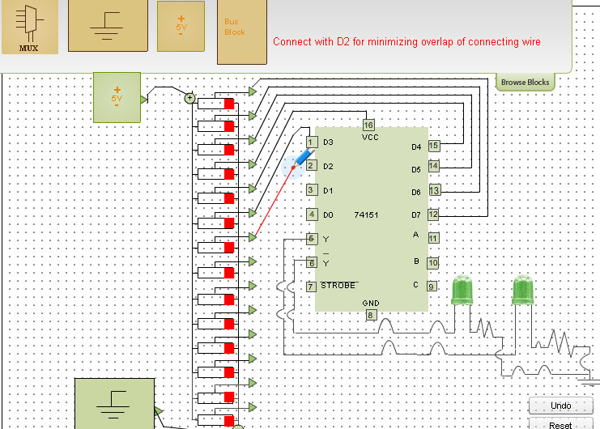
                                 
                                 
                               
  
                                 
                        
                        
                        
                        
                        
   <ul style="list-style:none">
                               
 <li class="expt1">13.&nbsp;Next, make a connection from switch H to D1 of the MUX block.</li>
                                
                                
  </ul>
                                
  
                                

                                 
                                 
                               

                                 
                                
                                
                                
 <ul style="list-style:none">
                               
 <li class="expt1">14.&nbsp;Next, make a connection from switch I to D0 of the MUX block.</li>
                                
                                
</ul>
                                
 
                                
 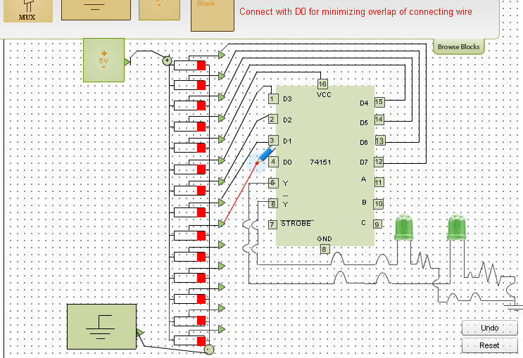
                                 
                                 
                               
 
                                 
                                
                                
   <ul style="list-style:none">
                               
<li class="expt1">15.&nbsp;Next, make a connection from switch J to STROBE of the MUX block.</li>
                                
                                
 </ul>
                                
   
                                
 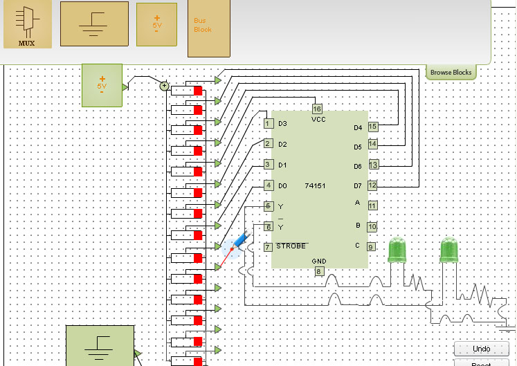
                                 
                                 
                               

                                 
                                
                                
  <ul style="list-style:none">
                               
  <li class="expt1">15.&nbsp;Next, make a connection from switch K to GND of the MUX block.</li>
                                
                                
  </ul>
                                
  
                                
 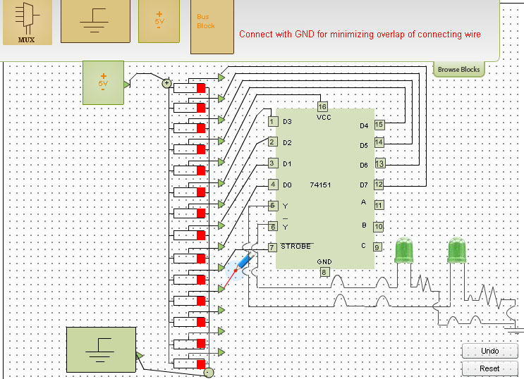
                                 
                                 
                               
 
                                 
                                
                                
 <ul style="list-style:none">
                               
<li class="expt1">16.&nbsp;Next, make a connection from switch L to C input of the MUX block.</li>
                                
                                
  </ul>
                                
   
                                
 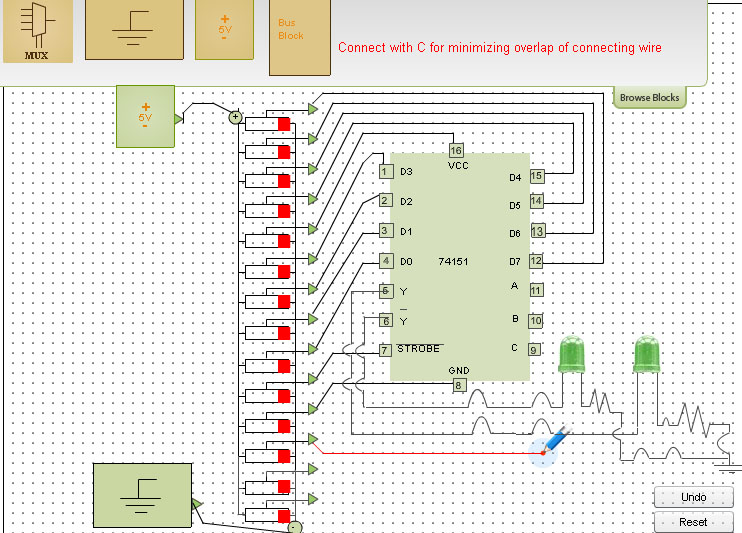
                                 
                                 
                               

                                 
                                
                                
 <ul style="list-style:none">
                               
<li class="expt1">17.&nbsp;Next, make a connection from switch M to B input of the MUX block.</li>
                                
                                
</ul>
                                
  
                                
  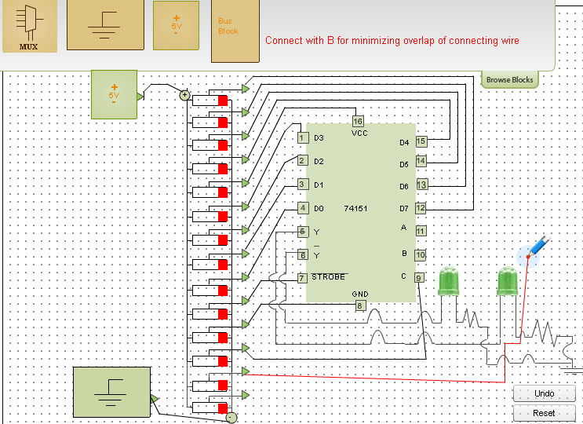
                                 
                                 
                               
  
                                 
                                
                                
 <ul style="list-style:none">
                               
<li class="expt1">18.&nbsp;Next, make a connection from switch N to A input of the MUX block.</li>
                                
                                
 </ul>
                                
 
                                

                                 
                                 
                               
 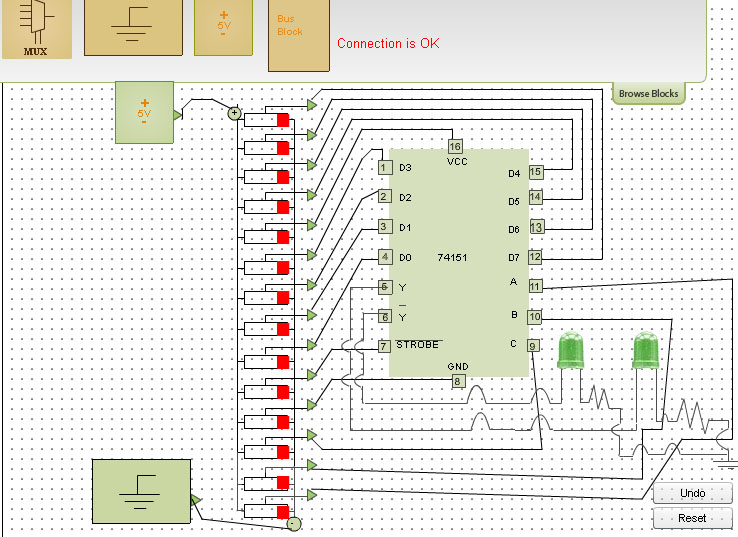
                                 
                                
                                
                                
<ul style="list-style:none">
                
<li class="expt1">17.&nbsp;Next, apply high level voltage to VCC and apply low level voltage to GND  and also apply low level voltage to the three select inputs A(MSB),B and C(LSB).</li>
                                             
                                             
                                             
 <li class="expt1">19.&nbsp;Next, apply high level voltage to D0 input.</li>
                                             
<li class="expt1">20.&nbsp;Now check that output Y attains logic high state.</li>
                                
                                
  </ul>
                                
  
                                
  
                                 
                               
                               
<ul style="list-style:none">
                               
                                             
                                             
 <li class="expt1">21.&nbsp;Next,  apply low level voltage to  A(MSB) and  B and apply high level voltage to C(LSB).</li>
                                             
<li class="expt1">22.&nbsp;Next, apply high level voltage to D1 input.</li>
                                             
 <li class="expt1">23.&nbsp;Now check that output Y attains logic high state.</li>
                                
                                
 </ul>
                                
 
                                
 
                                 
                               
                               
                               
  <ul style="list-style:none">
                               
                                             
                                             
 <li class="expt1">24.&nbsp;Next,  apply high level voltage to B and apply low level voltage to A(MSB)&nbsp; C(LSB).</li>
                                             
<li class="expt1">25.&nbsp;Next, apply high level voltage to D2 input.</li>
                                             
 <li class="expt1">26.&nbsp;Now check that output Y attains logic high state.</li>
                                
                                
  </ul>
                                
   
                                
 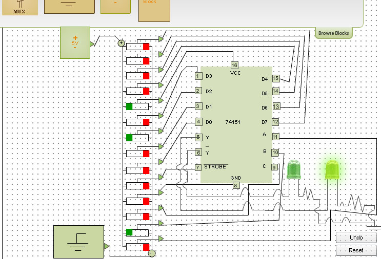
                                 
                                
                                
<ul style="list-style:none">
                               
                                             
                                             
  <li class="expt1">27.&nbsp;Next, apply high level voltage to C and B high and apply low level voltage to A(MSB).</li>
                                             
  <li class="expt1">28.&nbsp;Next, apply high level voltage to D3.</li>
                                             
 <li class="expt1">29.&nbsp;Now check that output Y attains logic high state.</li>
                                
                                
  </ul>
                                
 
                                
 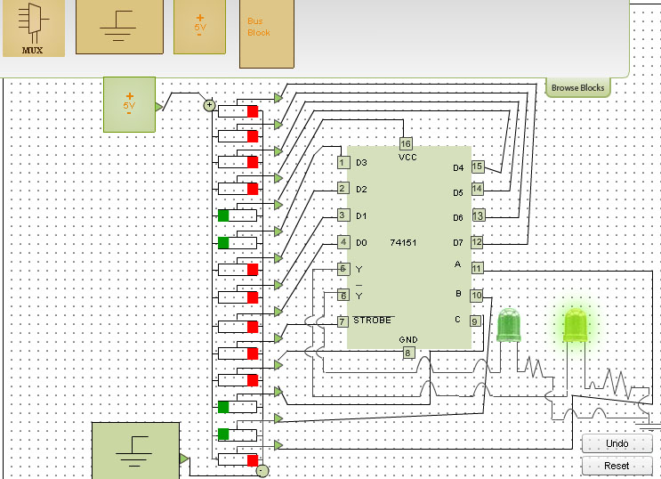
                                 
                                
  <ul style="list-style:none">
                                 <li class="expt1">
                                30.&nbsp;For all the combinations of the select inputs A,B,C verify that both the LEDs are glowing 
                                or not glowing. If the LED glows, it indicates that the corresponding output has reached logic 1 level. Similarly
                                a dark LED indicates low level output voltage.
                                </li>
                                </ul></ol>
                            
                        
