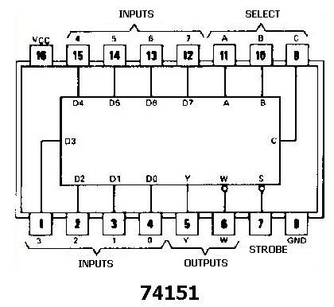

## Introduction

**About the Experiment**

This experiment enables a student to learn
- How to realize functionality of Dual 4 Line to 1 Line Multiplexer using 74153 IC
- How Dual 4 Line to 1 Line Multiplexer select the particular input to be sent to the output IY{1 = 1, 2}.
- How Each of the strobe signals IG {I = 1, 2} acts as an enable signal for the corresponding 4-to-1 M multiplexer.
- How to realize functionality of Quad 2 Line to 1 Line Multiplexer using 74157 IC
- How Quad 2 Line to 1 Line Multiplexer select the particular input to be sent to the output IY{1 = 1, 2, 3, 4}.
- How the strobe signal acts as an enable signal for each of the four 4-to-1 M multiplexers.

## Theory

74153 is a dual 4 line-to-1 line multiplexer. It has the schematic representation shown in Fig 1. Selection lines A and B select the particular input to be multiplexed and applied to the output IY{1 = 1, 2}.Each of the strobe signals IG {I = 1, 2} acts as an enable signal for the corresponding multiplexer.Figure 2(a) &amp; 2(b) shows the multiplex function of 74153 in terms of select lines. Note that each of the on-chip multiplexers act independently from the other, while sharing the same select lines A and B.
                          

 
                          

Figure 1(74153)

                          
Strobe | Select      |  Outputs 
1G     | A     | B   | 1Y
:--|:--|:--|:--|
1|x|x|0
0|0|0|1C0
0|0|0|1C1
0|0|0|1C2
0|0|0|1C3

                           
<table width="50%"  border="0" cellspacing="1px" cellpadding="2" bgcolor="#999999">
                             
<tr bgcolor="#FFFFCC">
                             <td>Strobe</td>
                             <td colspan="2">Select Lines</td>
                             <td>Outputs</td>
                             </tr>
                             
 <tr bgcolor="#FFFFCC">
                             <td>1G</td>
                             <td >A</td>
                             <td >B</td>
                             <td>1Y</td>
                             </tr>
                             
                             
 <tr bgcolor="#FFFFCC">
                             <td>1</td>
                             <td >x</td>
                             <td >x</td>
                             <td>0</td>
                             </tr>
                             
                             
 <tr bgcolor="#FFFFCC">
                             <td>0</td>
                             <td >0</td>
                             <td >0</td>
                             <td>1C0</td>
                             </tr>
                             
                             
                             
<tr bgcolor="#FFFFCC">
                             <td>0</td>
                             <td >0</td>
                             <td >1</td>
                             <td>1C1</td>
                             </tr>
                             
 <tr bgcolor="#FFFFCC">
                             <td>0</td>
                             <td >1</td>
                             <td >0</td>
                             <td>1C2</td>
                             </tr>
                             
 <tr bgcolor="#FFFFCC">
                             <td>0</td>
                             <td >1</td>
                             <td >1</td>
                             <td>1C3</td>
                             </tr>
                             
</table>
                             Figure 2(a)&nbsp;x:don't care state
                           
                             
                             
 <table width="50%"  border="0" cellspacing="1px" cellpadding="2" bgcolor="#999999">
                             
 <tr bgcolor="#FFFFCC">
                             <td>Strobe</td>
                             <td colspan="2">Select Lines</td>
                             <td>Outputs</td>
                             </tr>
                             
 <tr bgcolor="#FFFFCC">
                             <td>2G</td>
                             <td >A</td>
                             <td >B</td>
                             <td>2Y</td>
                             </tr>
                             
                             
 <tr bgcolor="#FFFFCC">
                             <td>1</td>
                             <td >x</td>
                             <td >x</td>
                             <td>0</td>
                             </tr>
                             
                             
 <tr bgcolor="#FFFFCC">
                             <td>0</td>
                             <td >0</td>
                             <td >0</td>
                             <td>2C0</td>
                             </tr>
                             
                             
                             
  <tr bgcolor="#FFFFCC">
                             <td>0</td>
                             <td >0</td>
                             <td >1</td>
                             <td>2C1</td>
                             </tr>
                             
  <tr bgcolor="#FFFFCC">
                             <td>0</td>
                             <td >1</td>
                             <td >0</td>
                             <td>2C2</td>
                             </tr>
                             
 <tr bgcolor="#FFFFCC">
                             <td>0</td>
                             <td >1</td>
                             <td >1</td>
                             <td>2C3</td>
                             </tr>
                             
 </table>
                              
                             Figure 2(b)&nbsp;x:don't care state
                              
                             
                              
                            

                           
The above circuit diagram shows the detail gate level structure of 74153(Dual 4 line to 1 line Multiplexer)

                            
                            
74157 is a quad 2 line-to-1 line multiplexer. It has the schematic representation shown
in Fig 3. Select line  select the particular input to be multiplexed and applied to the output IY{1 = 1, 2, 3, 4}.
Strobe signal acts as an enable signal for each of the four multiplexers. Figure 4(a) &amp; 4(b) &amp; 4(c) &amp; 4(d) shows the multiplex function of 74157 in terms of select lines. Note that each of the on-chip multiplexers act independently from the other, while sharing the same
select line.

                             
                           

                            Figure 3(74157)
                           

                           

                           
 <table width="50%"  border="0" cellspacing="1px" cellpadding="2" bgcolor="#999999">
                             
<tr bgcolor="#FFFFCC">
                             <td rowspan="2">Strobe</td>
                             <td rowspan="2">Select</td>
                             <td colspan="2">Inputs</td>
                             <td>Outputs</td>
                             </tr>
                             
 <tr bgcolor="#FFFFCC">
                             
<td >A1</td>
                             <td >B1</td>
                             <td>1Y</td>
                             </tr>
                             
                             
 <tr bgcolor="#FFFFCC">
                             <td>H</td>
                             <td >x</td>
                             <td >x</td>
                             <td>x</td>
                             <td>L</td>
                             </tr>
                             
                             
 <tr bgcolor="#FFFFCC">
                             <td>L</td>
                             <td >L</td>
                             <td >L</td>
                             <td>x</td>
                             <td>L</td>
                             </tr>
                             
                             
                             
 <tr bgcolor="#FFFFCC">
                             <td>L</td>
                             <td >L</td>
                             <td >H</td>
                             <td>x</td>
                             <td>H</td>
                             </tr>
                             
<tr bgcolor="#FFFFCC">
                             <td>L</td>
                             <td >H</td>
                             <td >x</td>
                             <td>L</td>
                             <td>L</td>
                             </tr>
                             
 <tr bgcolor="#FFFFCC">
                             <td>L</td>
                             <td >H</td>
                             <td >x</td>
                             <td>H</td>
                             <td>H</td>
                             </tr>
                             
 </table>
                              
                             Figure 4(a)&nbsp;x:don't care state
                              
                              
                             
                             
<table width="50%"  border="0" cellspacing="1px" cellpadding="2" bgcolor="#999999">
                             
<tr bgcolor="#FFFFCC">
                             <td rowspan="2">Strobe</td>
                             <td rowspan="2">Select</td>
                             <td colspan="2">Inputs</td>
                             <td>Outputs</td>
                             </tr>
                             
 <tr bgcolor="#FFFFCC">
                             
<td >A2</td>
                             <td >B2</td>
                             <td>2Y</td>
                             </tr>
                             
                             
  <tr bgcolor="#FFFFCC">
                             <td>H</td>
                             <td >x</td>
                             <td >x</td>
                             <td>x</td>
                             <td>L</td>
                             </tr>
                             
                             
 <tr bgcolor="#FFFFCC">
                             <td>L</td>
                             <td >L</td>
                             <td >L</td>
                             <td>x</td>
                             <td>L</td>
                             </tr>
                             
                             
                             
<tr bgcolor="#FFFFCC">
                             <td>L</td>
                             <td >L</td>
                             <td >H</td>
                             <td>x</td>
                             <td>H</td>
                             </tr>
                             
 <tr bgcolor="#FFFFCC">
                             <td>L</td>
                             <td >H</td>
                             <td >x</td>
                             <td>L</td>
                             <td>L</td>
                             </tr>
                             
 <tr bgcolor="#FFFFCC">
                             <td>L</td>
                             <td >H</td>
                             <td >x</td>
                             <td>H</td>
                             <td>H</td>
                             </tr>
                             
                             
</table>
                              
                             Figure 4(b)&nbsp;x:don't care state
                              
                            
                            
 <table width="50%"  border="0" cellspacing="1px" cellpadding="2" bgcolor="#999999">
                             
 <tr bgcolor="#FFFFCC">
                             <td rowspan="2">Strobe</td>
                             <td rowspan="2">Select</td>
                             <td colspan="2">Inputs</td>
                             <td>Outputs</td>
                             </tr>
                             
 <tr bgcolor="#FFFFCC">
                             
 <td >A3</td>
                             <td >B3</td>
                             <td>3Y</td>
                             </tr>
                             
                             
 <tr bgcolor="#FFFFCC">
                             <td>H</td>
                             <td >x</td>
                             <td >x</td>
                             <td>x</td>
                             <td>L</td>
                             </tr>
                             
                             
 <tr bgcolor="#FFFFCC">
                             <td>L</td>
                             <td >L</td>
                             <td >L</td>
                             <td>x</td>
                             <td>L</td>
                             </tr>
                             
                             
                             
 <tr bgcolor="#FFFFCC">
                             <td>L</td>
                             <td >L</td>
                             <td >H</td>
                             <td>x</td>
                             <td>H</td>
                             </tr>
                             
<tr bgcolor="#FFFFCC">
                             <td>L</td>
                             <td >H</td>
                             <td >x</td>
                             <td>L</td>
                             <td>L</td>
                             </tr>
                             
<tr bgcolor="#FFFFCC">
                             <td>L</td>
                             <td >H</td>
                             <td >x</td>
                             <td>H</td>
                             <td>H</td>
                             </tr>
                             
                             
 </table>
                             
   
                             Figure 4(c)&nbsp;x:don't care state
                              
                            
                            
 <table width="50%"  border="0" cellspacing="1px" cellpadding="2" bgcolor="#999999">
                             
<tr bgcolor="#FFFFCC">
                             <td rowspan="2">Strobe</td>
                             <td rowspan="2">Select</td>
                             <td colspan="2">Inputs</td>
                             <td>Outputs</td>
                             </tr>
                             
<tr bgcolor="#FFFFCC">
                             
<td >A4</td>
                             <td >B4</td>
                             <td>4Y</td>
                             </tr>
                             
                             
<tr bgcolor="#FFFFCC">
                             <td>H</td>
                             <td >x</td>
                             <td >x</td>
                             <td>x</td>
                             <td>L</td>
                             </tr>
                             
                             
 <tr bgcolor="#FFFFCC">
                             <td>L</td>
                             <td >L</td>
                             <td >L</td>
                             <td>x</td>
                             <td>L</td>
                             </tr>
                             
                             
                             
 <tr bgcolor="#FFFFCC">
                             <td>L</td>
                             <td >L</td>
                             <td >H</td>
                             <td>x</td>
                             <td>H</td>
                             </tr>
                             
  <tr bgcolor="#FFFFCC">
                             <td>L</td>
                             <td >H</td>
                             <td >x</td>
                             <td>L</td>
                             <td>L</td>
                             </tr>
                             
 <tr bgcolor="#FFFFCC">
                             <td>L</td>
                             <td >H</td>
                             <td >x</td>
                             <td>H</td>
                             <td>H</td>
                             </tr>
                                                     
  </table>
                                                       
 
                             Figure 4(d)&nbsp;x:don't care state
                            

                           
The above circuit diagram shows the detail gate level structure of 74157(Quad 2 line to 1 line Multiplexer)
                            
                             
74151 is a 8 line-to-1 line multiplexer. It has the schematic representation shown in Fig 5. Three select lines(A,B,C)  select the particular input to be multiplexed and
applied to the output Y,  Y is the inverted output of the original outpu(Y).  Strobe signal or Enable signal should be low to ensure proper multiplexing operation.If Enable is made high,then the output Y will always be low irrespective of any logic levels asserted by select lines A, B, C and the eight inputs.  

An 8-to-1 Multiplexer can be used to implement any 3-variable switching function. 

For example, consider the function

F (A,B,C) = &Sigma m (0,3,5)

Then the inputs D0, D3 and D5 should be set to logic 1 while the remaining five  inputs we set to logic '0'.

Thus, for A = 0, B = 0, C = 0  Y = D0 = '1'

for A = 0, B = 1, C = 1, Y = D1, = '1'

for A = 1, B = 0, C = 1, Y = D5, = '1'

For the remaining combination of A, B, C Y = '0'.

                            
 

                           

Figure 5(a)

<table width="50%"  border="0" cellspacing="1px" cellpadding="2" bgcolor="#999999">
                             
 <tr bgcolor="#FFFFCC">
                             <td rowspan="2">Strobe</td>
                             <td colspan="3">Select Lines</td>
                             <td colspan="8" align="center">Inputs</td>
                             <td colspan="2">Outputs</td>
                             </tr>
                             
<tr bgcolor="#FFFFCC">
                             
 <td >A</td>
                             <td >B</td>
                             <td >C</td>
                             <td >D0</td>
                             <td >D1</td>
                             <td >D2</td>
                             <td >D3</td>
                             <td >D4</td>
                             <td >D5</td>
                             <td >D6</td>
                             <td >D7</td>
                             <td>Y</td>
                             <td>Y</td>
                             </tr>
                             
                             
<tr bgcolor="#FFFFCC">
                             <td>H</td>
                             <td >X</td>
                             <td >X</td>
                             <td >X</td>
                             <td >X</td>
                             <td >X</td>
                             <td >X</td>
                             <td >X</td>
                             <td >X</td>
                             <td >X</td>
                             <td >X</td>
                             <td >X</td>
                             <td>L</td>
                             <td>H</td>
                             </tr>
                             
                             
 <tr bgcolor="#FFFFCC">
                             <td>L</td>
                             <td >L</td>
                             <td >L</td>
                             <td >L</td>
                             <td >H</td>
                             <td >X</td>
                             <td >X</td>
                             <td >X</td>
                             <td >X</td>
                             <td >X</td>
                             <td >X</td>
                             <td >X</td>
                             <td>H</td>
                             <td>L</td>
                             </tr>
                             
                             
                             
                            
                             
                             
 <tr bgcolor="#FFFFCC">
                             <td>L</td>
                             <td >L</td>
                             <td >L</td>
                             <td >L</td>
                             <td >L</td>
                             <td >X</td>
                             <td >X</td>
                             <td >X</td>
                             <td >X</td>
                             <td >X</td>
                             <td >X</td>
                             <td >X</td>
                             <td>L</td>
                             <td>H</td>
                             </tr>
                             
                             
 <tr bgcolor="#FFFFCC">
                             <td>L</td>
                             <td >L</td>
                             <td >L</td>
                             <td >H</td>
                             <td >X</td>
                             <td >H</td>
                             <td >X</td>
                             <td >X</td>
                             <td >X</td>
                             <td >X</td>
                             <td >X</td>
                             <td >X</td>
                             <td>H</td>
                             <td>L</td>
                             </tr>
                             
                             
 <tr bgcolor="#FFFFCC">
                             <td>L</td>
                             <td >L</td>
                             <td >L</td>
                             <td >H</td>
                             <td >X</td>
                             <td >L</td>
                             <td >X</td>
                             <td >X</td>
                             <td >X</td>
                             <td >X</td>
                             <td >X</td>
                             <td >X</td>
                             <td>L</td>
                             <td>H</td>
                             </tr>
                            
                             
 <tr bgcolor="#FFFFCC">
                             <td>L</td>
                             <td >L</td>
                             <td >H</td>
                             <td >L</td>
                             <td >X</td>
                             <td >X</td>
                             <td >H</td>
                             <td >X</td>
                             <td >X</td>
                             <td >X</td>
                             <td >X</td>
                             <td >X</td>
                             <td>H</td>
                             <td>L</td>
                             </tr>
                             
                             
  <tr bgcolor="#FFFFCC">
                             <td>L</td>
                             <td >L</td>
                             <td >H</td>
                             <td >L</td>
                             <td >X</td>
                             <td >X</td>
                             <td >L</td>
                             <td >X</td>
                             <td >X</td>
                             <td >X</td>
                             <td >X</td>
                             <td >X</td>
                             <td>L</td>
                             <td>H</td>
                             </tr>
                             
                             
<tr bgcolor="#FFFFCC">
                             <td>L</td>
                             <td >L</td>
                             <td >H</td>
                             <td >H</td>
                             <td >X</td>
                             <td >X</td>
                             <td >X</td>
                             <td >H</td>
                             <td >X</td>
                             <td >X</td>
                             <td >X</td>
                             <td >X</td>
                             <td>H</td>
                             <td>L</td>
                             </tr>
                             
                             
 <tr bgcolor="#FFFFCC">
                             <td>L</td>
                             <td >L</td>
                             <td >H</td>
                             <td >H</td>
                             <td >X</td>
                             <td >X</td>
                             <td >X</td>
                             <td >L</td>
                             <td >X</td>
                             <td >X</td>
                             <td >X</td>
                             <td >X</td>
                             <td>L</td>
                             <td>H</td>
                             </tr>
                             
                             
<tr bgcolor="#FFFFCC">
                             <td>L</td>
                             <td >H</td>
                             <td >L</td>
                             <td >L</td>
                             <td >X</td>
                             <td >X</td>
                             <td >X</td>
                             <td >X</td>
                             <td >H</td>
                             <td >X</td>
                             <td >X</td>
                             <td >X</td>
                             <td>H</td>
                             <td>L</td>
                             </tr>
                             
                             
                             
 <tr bgcolor="#FFFFCC">
                             <td>L</td>
                             <td >H</td>
                             <td >L</td>
                             <td >L</td>
                             <td >X</td>
                             <td >X</td>
                             <td >X</td>
                             <td >X</td>
                             <td >L</td>
                             <td >X</td>
                             <td >X</td>
                             <td >X</td>
                             <td>L</td>
                             <td>H</td>
                             </tr>
                             
 <tr bgcolor="#FFFFCC">
                             <td>L</td>
                             <td >H</td>
                             <td >L</td>
                             <td >H</td>
                             <td >X</td>
                             <td >X</td>
                             <td >X</td>
                             <td >X</td>
                             <td >X</td>
                             <td >H</td>
                             <td >X</td>
                             <td >X</td>
                             <td>H</td>
                             <td>L</td>
                             </tr>
                             
                             
<tr bgcolor="#FFFFCC">
                             <td>L</td>
                             <td >H</td>
                             <td >L</td>
                             <td >H</td>
                             <td >X</td>
                             <td >X</td>
                             <td >X</td>
                             <td >X</td>
                             <td >X</td>
                             <td >L</td>
                             <td >X</td>
                             <td >X</td>
                             <td>L</td>
                             <td>H</td>
                             </tr>
                             
                             
 <tr bgcolor="#FFFFCC">
                             <td>L</td>
                             <td >H</td>
                             <td >H</td>
                             <td >L</td>
                             <td >X</td>
                             <td >X</td>
                             <td >X</td>
                             <td >X</td>
                             <td >X</td>
                             <td >X</td>
                             <td >H</td>
                             <td >X</td>
                             <td>H</td>
                             <td>L</td>
                             </tr>
                             
                             
                                
 <tr bgcolor="#FFFFCC">
                             <td>L</td>
                             <td >H</td>
                             <td >H</td>
                             <td >L</td>
                             <td >X</td>
                             <td >X</td>
                             <td >X</td>
                             <td >X</td>
                             <td >X</td>
                             <td >X</td>
                             <td >L</td>
                             <td >X</td>
                             <td>L</td>
                             <td>H</td>
                             </tr>
                             
                             
                             
                             
  <tr bgcolor="#FFFFCC">
                             <td>L</td>
                             <td >H</td>
                             <td >H</td>
                             <td >H</td>
                             <td >X</td>
                             <td >X</td>
                             <td >X</td>
                             <td >X</td>
                             <td >X</td>
                             <td >X</td>
                             <td >X</td>
                             <td >H</td>
                             <td>H</td>
                             <td>L</td>
                             </tr>
                             
                             
                               
   <tr bgcolor="#FFFFCC">
                             <td>L</td>
                             <td >H</td>
                             <td >H</td>
                             <td >H</td>
                             <td >X</td>
                             <td >X</td>
                             <td >X</td>
                             <td >X</td>
                             <td >X</td>
                             <td >X</td>
                             <td >X</td>
                             <td >L</td>
                             <td>L</td>
                             <td>H</td>
                             </tr>
                          
</table>
                             
                             
 
                             Figure 5(b):&nbsp;Truth Table
