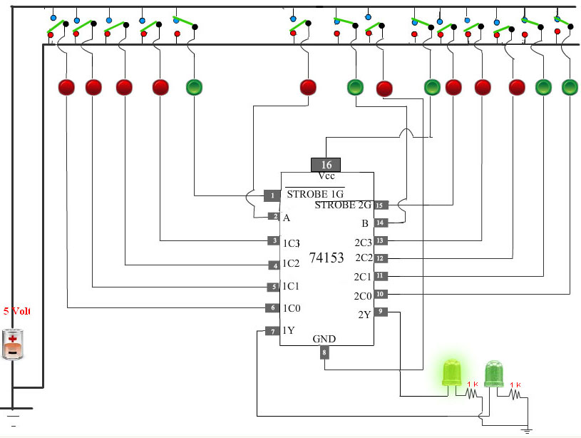

## Procedure

Please follow these steps to do the experiment.

#### Part 1:

1. At first go through the structure of 74153.Then apply high level voltage to Vcc and low level voltage to GND. If Vcc and ground are not connected properly then error message will be shown and no output will be generated.

2. Next,  apply high level voltage to Strobe1G  or strobe 2G. If STROBE 1G is high 2nd Multiplexer  is activated . If STROBE 2G is high then 1st Multiplexer is activated.

3. Next, apply low level voltage to the select inputs A and B (A Most significant Bit,B Less significant bit). Then apply a high level voltage to 2C0. Now check that how Dual 4 Line to 1 Line Multiplexer select the particular input to be multiplexed and to be applied to the output IY{1 = 1, 2}. 

4. For all the combinations of the select inputs A,B verify that both the LEDs are glowing or not glowing. If the LED glows, it indicates that the corresponding output has reached logic 1 level. Similarly a dark LED indicates low level output voltage.
                        

                               

5. If both the Strobe inputs are low then both Multiplexers are activated. 

#### Part 2:

1. At first go through the structure of 74157.Then apply high level voltage to Vcc and low level voltage to GND. If Vcc and ground are not connected properly then error message will be shown and no output will be generated.

2. Next,  apply high level voltage to Strobe input.Now check that all the LEDs are not  glowing.Soall the outputs are at low state

 
 3. Next,  apply low level voltage to the Strobe input  and also apply low level voltage to the Select input.  Then apply high level voltage to A1,A2,A3,A4.Now check that all the LEDs are glowing.Because inputs are properly multiplexed to the outputs of the four multiplexers according to the voltage applied to the select input. 
                                

4. Next,  apply low level voltage to the Strobe input  and apply high level voltage to the Select input. Then apply high level voltage to B1,B2,B3,B4. Now check that all the LEDs are glowing.Because inputs are properly multiplexed to the outputs of the four multiplexers according to the voltage applied to the select input. 
 

 
5. If the LED glows, it indicates that the corresponding output has reached logic 1 level. Similarly a dark LED indicates low level output voltage.  

 